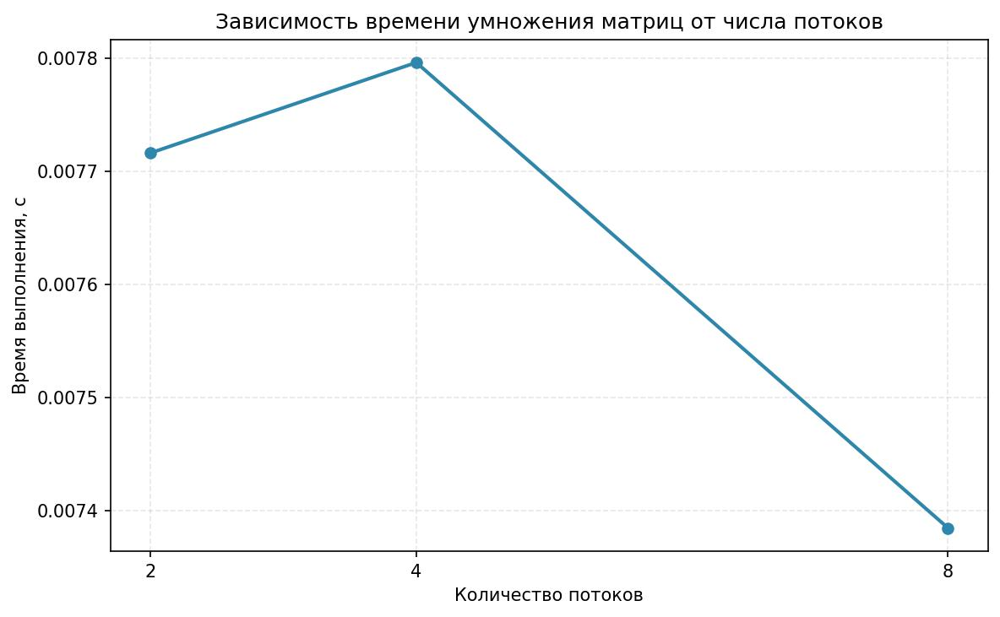
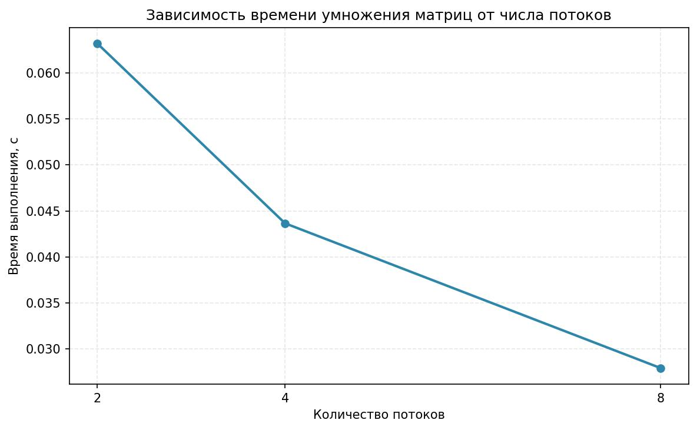
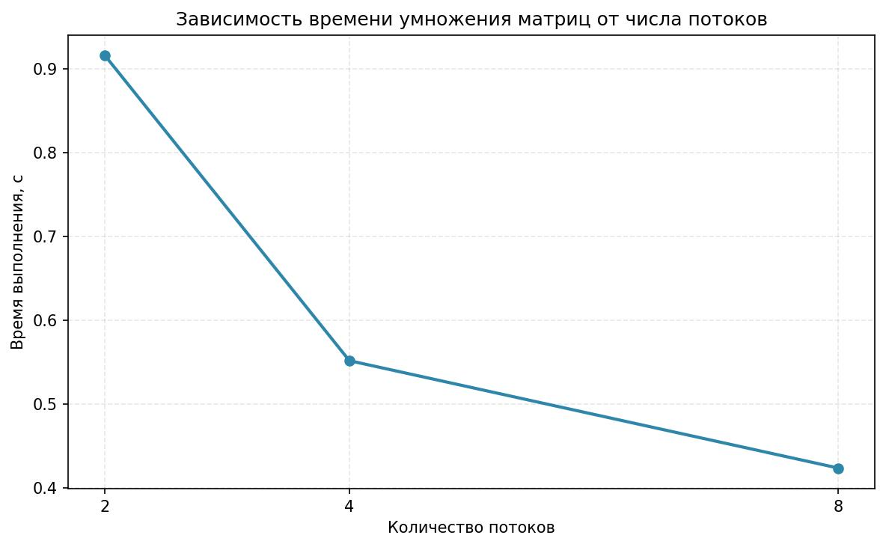
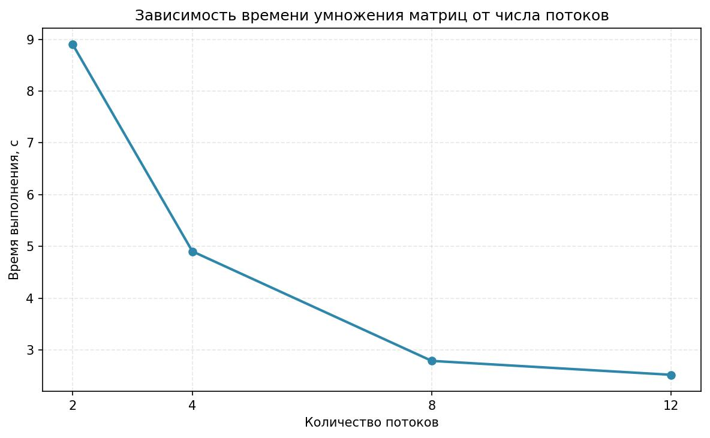
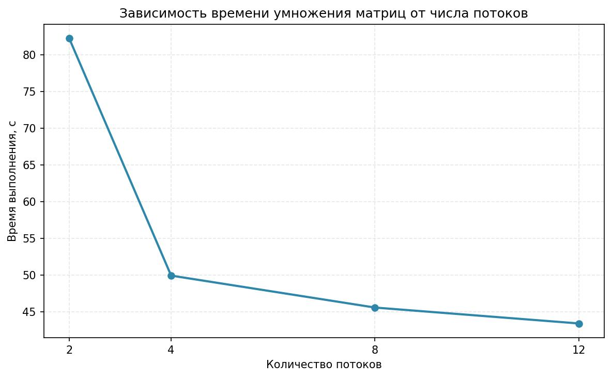

# Лабораторная работа №2: Параллельное умножение матриц с использованием OpenMP

## Информация о выполнившем

**Выполнил:** Студент группы 6214-100503D ФИ Левин Дмитрий

## Цель работы

Модифицировать программу умножения матриц для параллельной работы по технологии OpenMP и исследовать зависимость времени выполнения от количества потоков и размера матриц.

## Задание

Модифицировать программу из л/р №1 для параллельной работы по технологии OpenMP. Провести серию экспериментов с:

- Разным количеством потоков (1, 2, 4, 8 и т.д.)
- Разными размерами матриц (примерно 200, 400, 800, 1200, 1600, 2000)
- Разным количеством вычислительных ядер (1, 2, 4, 8 и т.д.)

## Ход работы

Была модифицирована часть умножения матриц по технологии OpenMP. Была добавлена часть для проведения исследования с разным количеством потоков.

Результаты исследования сохранены в файлах:

- `result_statistic` - исходные данные статистики
- `result_matrix` - результирующая матрица
- Графики визуализации: `res_100`, `res_200`, `res_500`, `res_1000`, `res_2000`

## Результаты экспериментов

### Графики зависимости времени выполнения от количества потоков

#### Размер матрицы 100×100

#### Размер матрицы 200×200

#### Размер матрицы 500×500

#### Размер матрицы 1000×1000

#### Размер матрицы 2000×2000

### Анализ полученных данных:

**1. Маленькие матрицы (размер 100-200):**

- Время выполнения: 0.007-0.06 секунды
- Наблюдается незначительное ускорение или его отсутствие
- Для таких размеров матриц параллелизация неэффективна

**2. Средние матрицы (размер 500-1000):**

- Время выполнения уменьшается с увеличением числа потоков
- Ускорение: примерно в 2-2.5 раза
- Наблюдается хороший прирост производительности при увеличении числа потоков до 4-8

**3. Большие матрицы (размер 2000):**

- Время выполнения: 82 секунды (2 потока) → 43 секунды (12 потоков)
- Ускорение: в 2-3.6 раза
- Наилучшая эффективность параллелизации

## Выводы

### 1. Зависимость эффективности от размера задачи

- **Малые размеры матриц (≤200):** Параллелизация неэффективна или даже вредна. Накладные расходы на создание и синхронизацию потоков превышают выигрыш от параллельных вычислений.
- **Средние размеры (500-1000):** Наблюдается умеренное ускорение (в 2-2.5 раза). Параллелизация начинает окупаться.
- **Большие размеры (≥2000):** Достигается наилучшее ускорение (до 3.6 раз). Параллелизация высокоэффективна.
