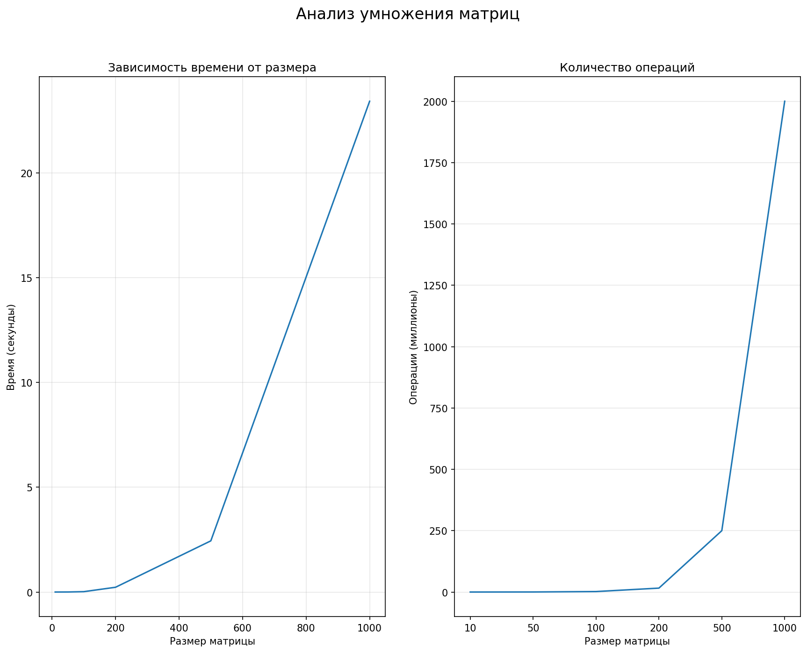

Умножение матриц: Анализ производительности

## Цель работы

Реализовать алгоритм умножения матриц, провести замеры производительности, проанализировать зависимость времени выполнения от размера входных данных.

## Технологии

- **C++ (стандарт C++11/14/17)** — основная реализация алгоритма
- **Python 3** — генерация тестовых матриц и визуализация результатов

# Структура проекта

```
├── lab_1.cpp   # Основная программа на C++
├── matrix_generation.py       # Скрипт генерации матриц A и B
├── visualize_stats.py         # Визуализация статистики (график)
├── matrix_A.txt, matrix_B.txt # Входные данные
├── result_matrix.txt          # Результирующая матрица
├── result_statistic.csv       # Замеры: размер, время, FLOPS
├── graf.png                   # График зависимости времени от размера,количества операций от размера
└── README.md
```

## Результаты экспериментов

| Размер матрицы (N) | Время (сек) | Операции (2×N³) |
| ------------------ | ----------- | --------------- |
| 10                 | 0.0000408   | 2 000           |
| 50                 | 0.0024149   | 250 000         |
| 100                | 0.018273    | 2 000 000       |
| 200                | 0.228041    | 16 000 000      |
| 500                | 2.44294     | 250 000 000     |
| 1000               | 23.4231     | 2 000 000 000   |

## Анализ результатов

фактическое время выполнения T(N):
T(N)≈k⋅N^3
где k — некоторая константа (зависит от процессора, компилятора, оптимизаций).

Сложность алгоритма: Реализован классический алгоритм умножения матриц со сложностью O(N^3). Это подтверждается ростом времени выполнения: при увеличении N в 2 раза время возрастает примерно в 8 раз.

```

```

### Графическое представление



На графиках представлены:

1. **Зависимость времени от размера** — показывает кубический рост времени выполнения
2. **Количество операций** — демонстрирует экспоненциальный рост вычислительной сложности

## Выводы

1. Реализован корректный алгоритм умножения матриц с валидацией входных данных
2. Проведены замеры производительности на 6 различных размерах матриц
3. Подтверждена кубическая сложность алгоритма экспериментально
4. Полученные графики наглядно демонстрируют O(N³) сложность алгоритма

```

```
